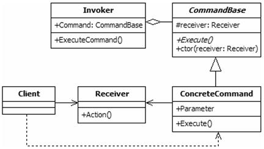
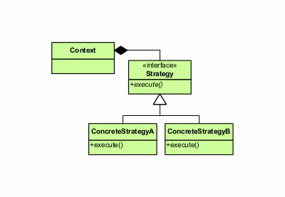
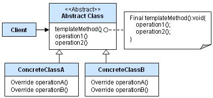

# Design patterns

## Sumário

1. [Abstract Factory](#abstract-factory)
2. [Adapter](#adapter)
3. [Builder](#builder)
4. [Chain of Responsability](#chain-of-responsability)
5. [Command](#command)
6. [Decorator](#decorator)
7. [Facade](#facade)
8. [Factory Method](#factory-method)
9. [Flyweight](#flyweight)
10. [Interpreter](#interpreter)
11. [Model View Controller](#model-view-controller)
12. [Observer](#observer)
13. [Prototype](#prototype)
13. [Proxy](#proxy)
14. [State](#state)
15. [Strategy](#strategy)
16. [Template](#template)

## Abstract Factory

Este padrão permite a criação de famílias de objetos relacionados ou dependentes por meio de uma única interface e sem que a classe concreta seja especificada. Uma fábrica é a localização de uma classe concreta no código em que objetos são construídos . O objetivo em empregar o padrão é isolar a criação de objetos de seu uso e criar famílias de objetos relacionados sem ter que depender de suas classes concretas. Isto permite novos tipos derivados de ser introduzidas sem qualquer alteração ao código que usa a classe base . O uso deste padrão torna possível trocar implementações concretas sem alterar o código que estas usam, mesmo em tempo de execução. No entanto, o emprego deste padrão, como acontece com outros padrões semelhantes, pode resultar em uma complexidade desnecessária e trabalho extra no início do código. Além disso, os níveis mais elevados de abstração podem resultar em sistemas que são mais difíceis de manter. A essência do padrão Abstract Factory é fornecer uma interface para criar famílias de objetos relacionados ou dependentes sem especificar suas classes concretas. 

## Adapter

De forma exemplificável por um adaptadores de cabos, o padrão Adapter converte a interface de uma classe para outra interface que o cliente espera encontrar, "traduzindo" solicitações do formato requerido pelo usuário para o formato compatível com o a classe adaptee e as redirecionando. Dessa forma, o Adaptador permite que classes com interfaces incompatíveis trabalhem juntas. Veja a aba exemplos.

O padrão Adapter pode ser utilizado quando:

* se deseja utilizar uma classe existente, porém sua interface não corresponde à interface que se necessita;
* o desenvolvedor quiser criar classes reutilizáveis que cooperem com classes não-relacionadas ou não-previstas, ou seja, classes que não possuem necessariamente interfaces compatíveis;
* (exclusivamente para adaptadores de objetos) é necessário utilizar muitas subclasses existentes, porém, impossível de adaptar essas interfaces criando subclasses para cada uma. Um adaptador de objeto pode adaptar a interface de sua classe mãe.

## Builder

Builder é um padrão de projeto de software criacional que permite a separação da construção de um objeto complexo da sua representação, de forma que o mesmo processo de construção possa criar diferentes representações. 

### Vantagens

* Permite variar a representação interna de um produto;
* Encapsula o código entre construção e representação;
* Provê controle durante o processo de construção.

### Desvantagens

* Requer criar um concrete builder específico para cada instância diferente do produto.

## Chain of Responsability

Em Orientação a Objetos, Chain of Responsibility é um padrão GOF cuja principal função é evitar a dependência entre um objeto receptor e um objeto solicitante. Consiste em uma série de objetos receptores e de objetos de solicitação, onde cada objetos de solicitação possui uma lógica interna que separa quais são tipos de objetos receptores que podem ser manipulados. O restante é passado para o próximo objetos de solicitação da cadeia.

Devido à isso, é um padrão que utiliza a ideia de baixo acoplamento por permitir que outros objetos da cadeia tenham a oportunidade de tratar uma solicitação. 

### Passo-a-passo

* A base mantém um ponteiro como "próximo";
* Cada classe derivada implementa sua própria contribuição para manusear o pedido (request);
* Se o pedido precisa ser passado para outra classe, então a classe derivada "chama de volta" à classe padrão, delegando um novo ponteiro;
* O cliente (terceirizado ou não) cria e encadeia a cadeia, a qual pode incluir uma ligação do último nó até o nó da raiz;
* O cliente lança e deixa cada request com a raiz da cadeia;
* As delegações recursivas produzem um efeito de ilusão;

## Command
Command é um dos 11 padrões comportamentais dentre os 23 padrões de projeto de software do GOF. Na programação orientada a objeto, o command é um padrão no qual um objeto é usado para encapsular toda informação necessária para executar uma ação ou acionar um evento em um momento posterior

O Padrão Command tem como definição encapsular uma solicitação como um objeto, o que lhe permite parametrizar outros objetos com diferentes solicitações, enfileirar ou registrar solicitações e implementar recursos de cancelamento de operações. Isso inclui informações como o nome do método, o objeto que o método pertence e os valores dos parâmetros do método. 

## Decorator

Decorator, wrapper (ou em português Decorador), é um padrão de projeto de software que permite adicionar um comportamento a um objeto já existente em tempo de execução, ou seja, agrega dinamicamente responsabilidades adicionais a um objeto. Decorators oferecem uma alternativa flexível ao uso de herança para estender uma funcionalidade, com isso adiciona-se uma responsabilidade ao objeto e não à classe. 

### Aplicabilidade

* Acrescentar ou remover responsabilidades a objetos individuais dinamicamente, de forma transparente
* Evitar a explosão de subclasses para prover todas as combinações de responsabilidades
* Acrescentar responsabilidades a um objeto dinamicamente
* Prover alternativa flexível ao uso de subclasses para se estender a funcionalidade de uma classe
* Pode-se utilizar Decorator quando a herança seria uma boa alternativa mas a definição da classe está escondida ou não disponível para herança
* pode usar um ou mais decoradores para englobar um objeto
* Os padrões Decorador e Composite podem ser visto como similares, uma vez que ambos usam o princípio de recursividade. O decorator pode ser visto como uma versão simplificada do padrão Composite, porém o Decorator apenas adiciona responsabilidades adicionais e não é usado para agregar objetos

## Facade

O Padrão de projeto Facade (ou Fachada) é um padrão de design de software usado comumente com programação orientada a objetos. Este nome é uma analogia para uma fachada arquitetural. Um Facade é um objeto que provê uma interface simplificada para um corpo de código maior, como por exemplo, uma biblioteca de classes.

O Padrão Facade é do tipo estrutural . É usado quando um sistema é muito complexo ou difícil de entender, já que possui um grande número de classes independentes ou se trechos de código fonte estão indisponíveis. Este padrão esconde as complexidades de um sistema maior e provê uma interface simplificada ao cliente. Tipicamente envolve uma única classe responsável por englobar uma série de membros requeridos pelo cliente. Estes membros acessam o sistema em nome do Facade e escondem os detalhes de implementação. 

### Aplicação

O Padrão Facade pode ser usado quando :

* Se deseja uma interface simplificada para um subsistema muito complexo. Subsistemas comumente ficam mais complexos a medida que evoluem e a maioria dos padrões, quando aplicados, resultam em muitas classes de pequeno tamanho. Isso torna o subsistema mais reutilizável e simples de se customizar.
* São muitas as dependências entre clientes e classes de implementação.
* Há o interesse em dividir seus subsistemas em camadas. Use um facade para definir um ponto de entrada para cada nível de subsistema. Se seus subsistemas são dependentes, essas dependências podem ser simplificadas entre sí ao se comunicarem unica e exclusivamente pelo facade.

## Factory Method

Factory Method ou Construtor virtual, na ciência da computação, é um padrão de projeto de software (design pattern, em inglês) que permite às classes delegar para subclasses decidirem, isso é feito através da criação de objetos que chamam o método fabrica especificado numa interface e implementado por um classe filha ou implementado numa classe abstrata e opcionalmente sobrescrito por classes derivadas. 

### Aplicações

* Quando a classe não antecipa a classe do objeto que quer criar.
* Uma classe quer suas subclasses para especificar os objetos que cria.
* Quando você não quer que o usuário tenha que saber de cada subclasse.
* Encapsular a criação de objetos.

## Flyweight

Flyweight é um padrão de projeto de software apropriado quando vários objetos devem ser manipulados em memória sendo que muitos deles possuem informações repetidas. Dado que o recurso de memória é limitado, é possível segregar a informação repetida em um objeto adicional que atenda as características de imutabilidade e comparabilidade (que consiga ser comparado com outro objeto para determinar se ambos carregam a mesma informação).

Um exemplo é o processador de texto. Cada caractere representa um objeto que possui uma família de fonte, um tamanho de fonte e outras informações sobre o símbolo. Como imaginado, um documento grande com tal estrutura de dados facilmente ocuparia toda a memória disponível no sistema. Para resolver o problema, como muitas dessas informações são repetidas, o flyweight é usado para reduzir os dados. Cada objeto de caractere contém uma referência para outro objeto com suas respectivas propriedades. 

## Interpreter
Dada uma determinada linguagem, o padrão Interpreter define uma representação para sua gramática juntamente com um interpretador que usa a representação para interpretar sentenças na língua. Ou mapear um domínio para uma língua, a língua para uma gramática e a gramática para um projeto de design hierárquico orientado a objetos. 

### Casos de uso

* Formato das consultas em banco de dados especializados como em SQL.
* Formato de mensagens usados pelos protocolos de comunicação.
* Tradução/conversão de linguagens ou símbolos para outra linguagem como números romanos para números decimais.
* Uso em expressões regulares ou XML.
* Uso de interpretação de formato em datas como DD-MM-AAAA ou MM-DD-AAAA.

## Model View Controller

MVC é o acrônimo de Model-View-Controller (em português: Arquitetura Modelo-Visão-Controle - MVC) é um padrão de projeto de software, ou padrão de arquitetura de software formulado na década de 1970, focado no reuso de código e a separação de conceitos em três camadas interconectadas, onde a apresentação dos dados e interação dos usuários (front-end) são separados dos métodos que interagem com o banco de dados (back-end).

Normalmente usado para o desenvolvimento de interfaces de usuário que divide uma aplicação partes (camadas/componentes) interconectadas. Isto é feito para separar representações de informação internas dos modos como a informação é apresentada para e aceita pelo usuário, levando ao desenvolvimento paralelo de maneira eficiente. 

### Interação dos componentes

Além de dividir a aplicação em três tipos de componentes, o desenho MVC define as interações entre eles.

* O Controlador (controller) envia comandos para o modelo para atualizar o seu estado (por exemplo, editando um documento). O controlador também pode enviar comandos para a visão associada para alterar a apresentação da visão do modelo (por exemplo, percorrendo um documento).
* Um modelo (model) armazena dados e notifica suas visões e controladores associados quando há uma mudança em seu estado. Estas notificações permitem que as visões produzam saídas atualizadas e que os controladores alterem o conjunto de comandos disponíveis. Uma implementação passiva do MVC monta estas notificações, devido a aplicação não necessitar delas ou a plataforma de software não suportá-las.
* A visão (view) gera uma representação (Visão) dos dados presentes no modelo solicitado, fazendo a exibição dos dados, sendo ela por meio de um html ou xml.

## Observer

O Observer é um padrão de projeto de software que define uma dependência um-para-muitos entre objetos de modo que quando um objeto muda o estado, todos seus dependentes são notificados e atualizados automaticamente. Permite que objetos interessados sejam avisados da mudança de estado ou outros eventos ocorrendo num outro objeto.

O padrão Observer é também chamado de Publisher-Subscriber, Event Generator e Dependents. 

O padrão Observer pode ser usado quando uma abstração tem dois aspectos, um dependente do outro. Encapsular tais aspectos em objetos separados permite que variem e sejam reusados separadamente. Quando uma mudança a um objeto requer mudanças a outros e você não sabe quantos outros objetos devem mudar ou quando um objeto deve ser capaz de avisar outros sem fazer suposições sobre quem são os objetos. Em outras palavras, sem criar um acoplamento forte entre os objetos. 

## Prototype

Prototype, na ciência da computação, é um padrão de projeto de software (design pattern, em inglês). Criacional que permite a criação de novos objetos a partir de um modelo original ou protótipo que é clonado.

Este padrão pode ser utilizado para: 

* Evitar que as subclasses que criam objetos funcionem como o padrão abstract factory;
* Evitar criar um novo objeto utilizando a palavra new, o que diminui o custo de memória.
* Basicamente, ao em vez de o cliente implementar um código que utiliza o operador new, este utiliza o método clone() presente no protótipo e o método de uma fábrica(Factory Method ou Abstratct Factory) que fica encarregada de clonar o novo objeto.

O padrão Prototype é aplicado quando existe a necessidade de clonar, literalmente, um objeto. Ou seja, quando a aplicação precisa criar cópias exatas de algum objeto em tempo de execução este padrão é altamente recomendado. Este padrão pode ser utilizado em sistemas que precisam ser independentes da forma como os seus componentes são criados, compostos e representados. O padrão Prototype pode ser útil em sistemas com as seguintes características: 

* sistemas que utilizam classes definidas em tempo de execução;
* sistemas que utilizam o padrão Abstract Factory para criação de objetos. Neste caso, a hierarquia de classes pode se tornar muito complexa e o padrão Prototype pode ser uma alternativa mais simples, por realizar a mesma tarefa com um número reduzido de classes;
* sistemas que possuem componentes cujo estado inicial possui poucas variações e onde é conveniente disponibilizar um conjunto preestabelecido de protótipos que dão origem aos objetos que compõem o sistema.

## Proxy

Um proxy, em sua forma mais geral, é uma classe que funciona como uma interface para outra coisa. O proxy pode fazer interface com qualquer coisa: uma conexão de rede, um objeto grande na memória, um arquivo ou algum outro recurso caro ou impossível de duplicar. Em resumo, um proxy é um objeto de invólucro ou agente que está sendo chamado pelo cliente para acessar o objeto de veiculação real nos bastidores. O uso do proxy pode simplesmente ser encaminhado para o objeto real ou pode fornecer lógica adicional. No proxy, pode ser fornecida funcionalidade extra, por exemplo, armazenamento em cache quando as operações no objeto real requerem muitos recursos ou verificação de condições prévias antes que as operações no objeto real sejam invocadas. Para o cliente, o uso de um objeto proxy é semelhante ao uso do objeto real, porque ambos implementam a mesma interface.

## State 

O padrão de estado é um padrão de design de software comportamental que permite que um objeto altere seu comportamento quando seu estado interno for alterado. Esse padrão está próximo do conceito de máquinas de estado finito. O padrão de estado pode ser interpretado como um padrão de estratégia, capaz de alternar uma estratégia através de invocações de métodos definidos na interface do padrão.

O padrão de estado é usado na programação de computadores para encapsular comportamentos variáveis ​​para o mesmo objeto, com base em seu estado interno. Essa pode ser uma maneira mais limpa de um objeto alterar seu comportamento em tempo de execução sem recorrer a instruções condicionais e, assim, melhorar a capacidade de manutenção.

### O padrão de estado está definido para resolver dois problemas principais: 

* Um objeto deve mudar seu comportamento quando seu estado interno mudar.
* O comportamento específico do estado deve ser definido independentemente. Ou seja, adicionar novos estados não deve afetar o comportamento dos estados existentes.

## Strategy

Strategy é um padrão de projeto de software (do inglês design pattern), pode ser chamado de policy. Este padrão foi documentado no Catálogo GOF (Gang of Four), sendo categorizado como um padrão comportamental de desenvolvimento de software.  De modo que delega as responsabilidades adquiridas pelas entidades, atribuindo, portanto, o comportamento. Assim a comunicação entre os objetos é aprimorada, pois há a distribuição das responsabilidades. O objetivo é representar uma operação a ser realizada sobre os elementos de uma estrutura de objetos. O padrão Strategy permite definir novas operações sem alterar as classes dos elementos sobre os quais opera. Segundo o catálogo GOF o padrão tem como meta: "Definir uma família de algoritmos, encapsular cada uma delas e torná-las intercambiáveis. Strategy permite que o algoritmo varie independentemente dos clientes que o utilizam."

### O padrão tem como habilidade:

* Define uma família de algoritmos;
* Encapsular cada algoritmo como uma classe;
* Permite que eles possam ser trocados entre si.
* Este padrão permite que o algoritmo possa variar independentemente dos clientes que o utilizam.

O padrão é aplicado em situações em que muitas classes se relacionam e diferem apenas no modo de atuação, com isso o Strategy irá configurar a classe que tenha um dentre muitos comportamentos fornecidos. Também pode ser usado quando há a necessidade da variação de um algoritmo, ou seja, pode-se implementar diferentes códigos que chegam no mesmo objetivo, mas que possuem em determinadas situações mais vantagens do que os demais.

Outra situação oportuna para o uso do padrão é em uma aplicação na qual se tem um cliente e este não pode ficar exposto a estrutura de dados do algoritmo. Além disso, quando uma classe tem muitos comportamentos e usam vários comandos condicionais, o desempenho do algoritmo poderá ficar insatisfatório, pois há a possibilidade de existir uma quantidade grande de condições, podendo deixar o código mais lento. Com o padrão pode-se retirar as condições, criando novas classes com estas estratégias, portanto melhorando desempenho.  

## Template

Um Template Method auxilia na definição de um algoritmo com partes do mesmo definidos por métodos abstratos. As subclasses devem se responsabilizar por estas partes abstratas, deste algoritmo, que serão implementadas, possivelmente de várias formas, ou seja, cada subclasse irá implementar à sua necessidade e oferecer um comportamento concreto construindo todo o algoritmo.

O Template Method fornece uma estrutura fixa, de um algoritmo, esta parte fixa deve estar presente na superclasse, sendo obrigatório uma classeAbstrata que possa conter um método concreto, pois em uma interface só é possível conter métodos abstratos que definem um comportamento, esta é a vantagem de ser uma Classe Abstrata porque também irá fornecer métodos abstratos às suas subclasses, que por sua vez herdam este método, por Herança (programação), e devem implementar os métodos abstratos fornecendo um comportamento concreto aos métodos que foram definidos como abstratos. Com isso certas partes do algoritmo serão preenchidos por implementações que irão variar, ou seja, implementar um algoritmo em um método, postergando a definição de alguns passos do algoritmo, para que outras classes possam redefiní-los. 

### Uso

O método de template é usado em estruturas, nas quais cada uma implementa as partes invariantes da arquitetura de um domínio, enquanto fornece métodos de gancho para personalização. Este é um exemplo de inversão de controle. O método do template é usado pelos seguintes motivos.

* Permite que as subclasses implementem comportamentos variados (substituindo os métodos de gancho).
* Evita duplicação no código: o fluxo de trabalho geral do algoritmo é implementado uma vez no método de modelo da classe abstrata e as variações necessárias são implementadas nas subclasses. 
* Controla o (s) ponto (s) em que a especialização é permitida. Se as subclasses simplesmente substituíssem o método do modelo, elas poderiam fazer alterações radicais e arbitrárias no fluxo de trabalho. Por outro lado, substituindo apenas os métodos de gancho, apenas certos detalhes específicos do fluxo de trabalho podem ser alterados  e o fluxo de trabalho geral é deixado intacto.

